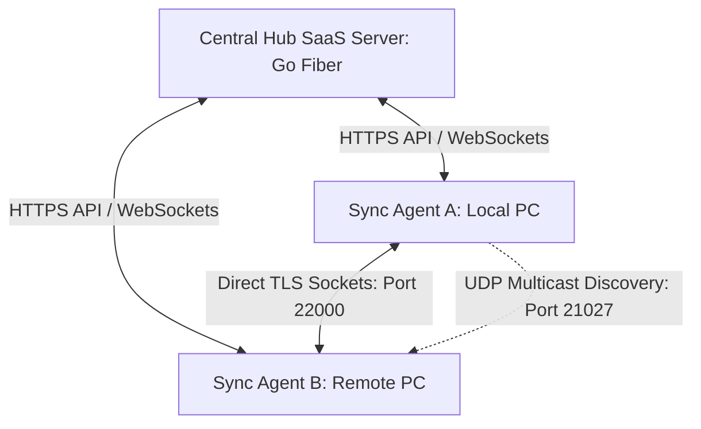

# 🌌 Horsync: Next-Gen Hybrid P2P & SaaS File Sync & Privacy Suite

Horsync is a high-performance, cyberpunk-themed file synchronization and privacy suite that combines centralized SaaS control (Hub) with secure, direct peer-to-peer (P2P) block exchange between client nodes. 

It is designed to bypass traditional browser constraints, incorporating client-side zero-knowledge encryption, automated metadata stripping, and cross-platform native background services.

---

## 🏗️ Architectural Overview & Core Engine

Horsync operates on a hybrid architecture to optimize security, control, and transfer speeds:



1. **SaaS Control Plane (Hub)**: A Go-based Fiber server managing device enrollments, system configurations, automated rules, audit logs, and network coordination.
2. **Direct P2P Block Exchange (BEP)**: Direct TCP socket connections (Port `22000`) wrapped in secure TLS. A custom Block Exchange Protocol allows client nodes to request and sync data blocks directly without passing payloads through the central Hub.
3. **UDP Multicast Discovery**: Passive LAN broadcast listening on Port `21027` that automatically discovers local peer nodes and renders them dynamically in the UI.
4. **Zero-Knowledge Vault**: Browser-side client encryption using AES-GCM 256-bit keys derived locally via PBKDF2 (100,000 iterations). Raw keys never leave local RAM.
5. **Metadata Stripping Engine**: Native binary handlers that strip sensitive EXIF (GPS, camera model) from images and XML XMP/Metadata info from PDF/Office documents during transfer finalization.

---

## 🔥 Key Features

* **Dynamic OS Detection & Onboarding**: Automatically detects client operating systems on the onboarding dashboard, highlighting the recommended script downloader with a glowing neon frame. It generates tailored Windows `.bat` and Linux/macOS `.sh` 1-click installer scripts.
* **Smart Local IP Auto-Discovery**: Excludes virtual network adapter ranges (WSL `172.`, VMnet `192.168.111.`, APIPA `169.254.`) to identify the main LAN network IP and pre-bake it into generated installer scripts for instant zero-config agent connection.
* **Interactive SVG Mesh Topology Map**: Renders centralized and direct direct P2P link animations with color-coded status packet pulses (Green: Active, Amber: Pending, Grey: Offline). Clicking a node launches a floating real-time telemetry details drawer (CPU, Uptime, IP, Sync Mode).
* **HTML5 Directory/Folder Upload**: Allows dragging or choosing entire folders recursively from the browser. Directory structures are preserved, staged, and shown in an interactive cyberpunk **"Folder Import Verification Required"** panel for explicit user approval before sequential chunked transfer begins.
* **P2P High Approval Mode (Strict Verification)**: An database-driven security toggle. When active, direct peer-to-peer connection requests are rejected immediately during the TLS handshake unless the node is marked as `"active"` in the PostgreSQL control plane database.
* **Bandwidth Governor & Throttling**: A token-bucket rate limiter that restricts download speeds to a maximum threshold (e.g., `128 KB/s`) when configured, avoiding local network congestion.

---

## 🛠️ Setup and Installation

### Prerequisites
* **Golang** (v1.20 or higher)
* **Node.js** (v18 or higher)
* **Docker Desktop** (for database virtualization)

### Quick Start (Windows Dev Runner)
Execute the unified starter batch script in the root directory:
```bash
run_mvp.bat
```
This automated script will:
1. Spin up the PostgreSQL database container on port `5433`.
2. Install frontend npm dependencies.
3. **Automatically compile the fresh Go server binary (`bin/horsync.exe`).**
4. Launch both the Hub server and Vite dev server in parallel.
5. Automatically open the browser at `http://localhost:3000`.

### Default Credentials
* **Username:** `admin@horsync.local`
* **Password:** `admin12345`

---

## 🧪 Verification & Testing Scenarios

Use the following scenarios to evaluate the platform's security and synchronization mechanics:

### Test 1: Dynamic Agent Onboarding & IP Verification
1. Open the Hub UI and navigate to the **Nodes** panel.
2. Generate an enrollment token and register a device.
3. Click the pulsing **Download Windows Installer (.bat)** button.
4. Verify the downloaded script is pre-filled with the Hub's real LAN network IP (e.g. `http://192.168.1.112:3001`) instead of `localhost`.
5. Run the `.bat` script next to `horsync.exe` on a 2nd PC on the same network to verify the agent successfully connects and displays as `active`.

### Test 2: Recursive Folder Upload Staging
1. Go to the **File Explorer** tab and select **Choose Folder**.
2. Stage a directory containing nested files.
3. Inspect the amber-glowing **Folder Import Verification Required** panel displaying the folder name, file count, and cumulative size.
4. Click **Approve & Sync Folder** and watch the sequential chunked uploads stream relative to the global progress bar.
5. Check `data/uploads/[SESSION_ID]/` on the host filesystem to verify the directory structure was recursively generated.

### Test 3: Metadata Stripping & Audit Logs
1. Change the metadata mode to **Warn & Confirm** in the Policies tab.
2. Upload a JPEG image containing GPS EXIF coordinates.
3. Verify the file shows a blinking amber **"Sensitive Metadata (EXIF/GPS) Detected"** warning badge.
4. Click **1-Click Wipe** to strip metadata, and verify the badge turns green (**"Safe & Clean"**) and the file's SHA-256 hash updates dynamically.
5. Navigate to the **Control Hub** dashboard to verify the `file.metadata.wipe` action was recorded in the system audit logs.

### Test 4: ZK Cryptographic Vault
1. Open the **Security Vault** tab and set a master passphrase.
2. Lock a directory to trigger in-browser client-side encryption.
3. Verify files on the host system are fully encrypted using **AES-GCM 256-bit** and that raw files cannot be read without the password.

### Test 5: Strict P2P Handshake Validation
1. Enable **"P2P High Approval Mode"** in Settings.
2. Change the status of a registered node to `pending` or `rejected` in the Nodes list.
3. Attempt to start the direct agent on that node and verify the TLS connection is instantly terminated during the handshake phase.
